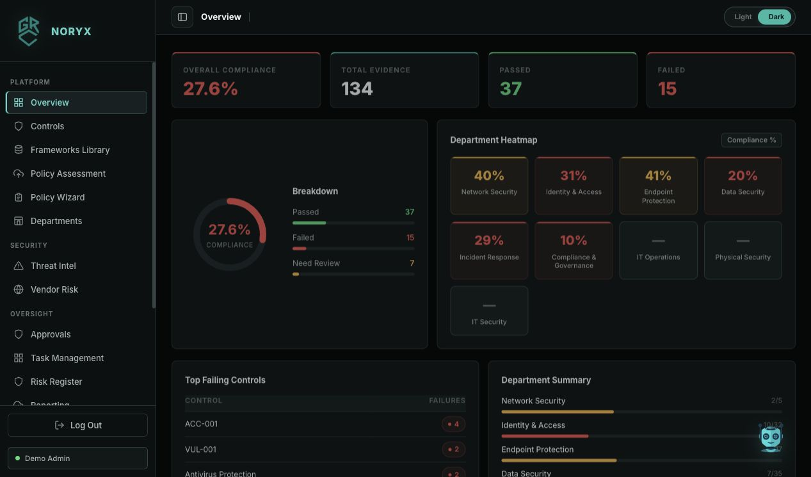
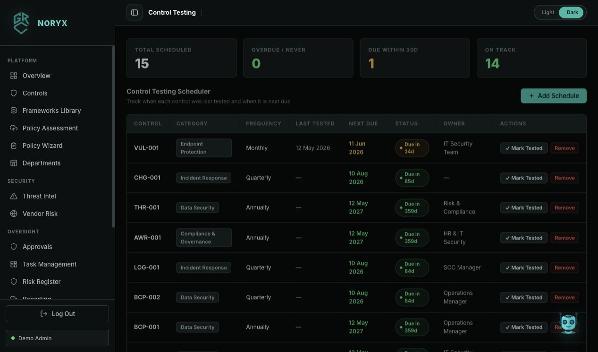

# NORYX

**NORYX** is an AI-powered Governance, Risk, and Compliance platform built to help organizations manage cybersecurity controls, evidence, policies, risks, departments, vendors, testing schedules, exceptions, audit findings, and compliance reporting from one unified workspace.

The platform combines a React dashboard, a FastAPI backend, SQLite persistence, local AI evidence validation, threat prediction, and Ollama-powered GRC assistance.

## Team Members

| Name | Role |
|---|---|
| Fuad Alawi | Team Member |
| Majd Hallawni | Team Member |
| Abbduall Al-Qhtani | Team Member |
| Prof. Reda Salama | Supervisor |

## Platform Screenshots

### Admin Dashboard



### Control Testing



## Key Features

- **Admin and employee workspaces** with role-based navigation.
- **Control management** for cybersecurity and compliance controls.
- **Department mapping** to assign controls and tasks to the right teams.
- **Evidence upload and review workflow** with automated AI validation.
- **Manager approval workflow** for evidence that needs review.
- **Task management** for implementation and remediation work.
- **Risk register** with failed-evidence risk creation.
- **Threat intelligence panel** powered by the local threat prediction model.
- **Framework library** for NCA ECC, ISO 27001, ISO 27002, NIST CSF, SAMA CSF, PDPL, and SCF references.
- **Policy assessment engine** for uploading company policies and comparing them against selected frameworks.
- **Policy wizard** for generating structured policy drafts.
- **GRCXPERT Assistance** using Ollama and `gemma4:eb4` for local GRC guidance.
- **Vendor risk management** for third-party security tracking.
- **Control testing scheduler** to track test frequency, owners, last-tested dates, and next due dates.
- **Exception register** for approved control deviations.
- **Audit findings tracker** for audit observations and remediation progress.
- **Compliance heatmap** for department and category-level visibility.
- **PDF reporting** for compliance summaries.

## Tech Stack

| Layer | Technology |
|---|---|
| Frontend | React, Vite, CSS |
| Backend | FastAPI, SQLAlchemy |
| Database | SQLite |
| Authentication | Firebase Authentication |
| AI Evidence Validation | EasyOCR, OpenCV, scikit-learn/joblib models |
| Threat Prediction | PyTorch, Transformers, scikit-learn |
| Local LLM Assistant | Ollama with `gemma4:eb4` |
| Reporting | ReportLab |

## Project Structure

```text
Noryx/
├── backend/                  # FastAPI API, models, AI logic, reporting
├── frontend/                 # React + Vite user interface
├── data/                     # Framework references and test documents
├── docs/screenshots/         # README screenshots
├── scripts/                  # Import, migration, extraction, and test scripts
└── NCAControls/              # NCA control reference material
```

## Run Locally

Open two terminal tabs.

### 1. Backend

```bash
cd "/Users/fuadxxx/Documents/NORYX-_-/Noryx/backend"

python3 -m venv .venv
source .venv/bin/activate

pip install --upgrade pip
pip install fastapi uvicorn sqlalchemy "python-jose[cryptography]" "passlib[bcrypt]" python-multipart reportlab

python -m uvicorn main:app --host 127.0.0.1 --port 8000
```

Backend URL:

```text
http://127.0.0.1:8000
```

### 2. Frontend

```bash
cd "/Users/fuadxxx/Documents/NORYX-_-/Noryx/frontend"

npm install
npm run dev -- --host 127.0.0.1
```

Frontend URL:

```text
http://127.0.0.1:5173/
```

## AI Model Setup

The repository ignores large local model artifacts and virtual environments. If you need full AI evidence validation and threat prediction, install the extra model dependencies:

```bash
cd "/Users/fuadxxx/Documents/NORYX-_-/Noryx/backend"
source .venv/bin/activate

pip install opencv-python easyocr joblib scikit-learn numpy torch torchvision transformers
```

Expected local model files:

```text
backend/category_model.pkl
backend/compliance_model_v2.pkl
backend/threat_model_v2.pkl
backend/bert_category_model/
backend/bert_compliance_model/
```

These are intentionally excluded from Git because they are large generated artifacts.

## Ollama / GRCXPERT Setup

NORYX expects Ollama to run locally on:

```text
http://127.0.0.1:11434
```

Start Ollama:

```bash
ollama serve
```

Install or verify the configured model:

```bash
ollama list
ollama pull gemma4:eb4
ollama run gemma4:eb4 "Explain GRC in one short paragraph."
```

Test the backend GRCXPERT endpoint after the backend is running:

```bash
curl http://127.0.0.1:8000/grcxpert-assistance/chat \
  -H "Content-Type: application/json" \
  -d '{
    "message": "How can a company comply with NCA ECC?",
    "language": "en"
  }'
```

If the response includes `"source":"ollama"`, the local Gemma model is connected successfully.

## Testing

### Frontend Build Check

```bash
cd "/Users/fuadxxx/Documents/NORYX-_-/Noryx/frontend"
npm run build
```

### Backend Smoke Check

With the backend running:

```bash
curl http://127.0.0.1:8000/departments/
curl http://127.0.0.1:8000/controls/
curl http://127.0.0.1:8000/dashboard/stats
```

### Evidence Model Test

```bash
cd "/Users/fuadxxx/Documents/NORYX-_-/Noryx/backend"
source .venv/bin/activate

python - <<'PY'
import ai_engine

status, text, confidence = ai_engine.validate_evidence(
    "uploads/test_images/acc_correct_1.png",
    "access control password mfa authentication identity"
)

print("Status:", status)
print("Confidence:", confidence)
print("Extracted text preview:", text[:300])
PY
```

### Full Evidence Test Suite

Start the backend first, then run:

```bash
cd "/Users/fuadxxx/Documents/NORYX-_-/Noryx/backend"
source .venv/bin/activate

python run_evidence_tests.py
```

### Threat Prediction Test

```bash
cd "/Users/fuadxxx/Documents/NORYX-_-/Noryx/backend"
source .venv/bin/activate

python - <<'PY'
import threat_predictor

results = threat_predictor.predict_threats(
    control_name="Multi-factor authentication",
    control_description="Users must use MFA for privileged access",
    control_category="Identity & Access",
    top_n=3
)

for item in results:
    print(item["technique_id"], item["name"], item["severity_label"], item["combined_score"])
PY
```

## Default Seeded Backend Users

The backend seeds example users for API testing:

| Username | Password | Role |
|---|---|---|
| `admin` | `admin123` | Admin |
| `employee` | `emp123` | Employee |

The frontend authentication flow uses Firebase Authentication.

## Notes

- Local SQLite files are ignored because they contain runtime data.
- Uploaded evidence files and generated policy reports are ignored.
- Large model weights are ignored and should be shared through a model registry, release artifact, or local setup package.
- The frontend expects the backend at `http://localhost:8000`.
- GRCXPERT expects Ollama at `http://127.0.0.1:11434`.

## License

This project was developed for academic and demonstration purposes.
